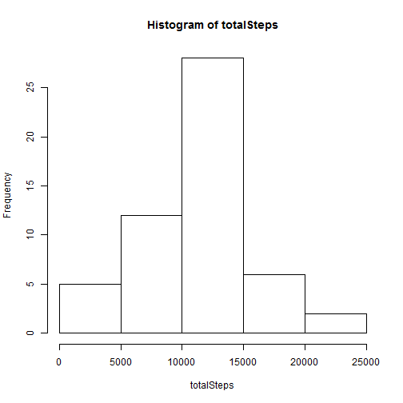
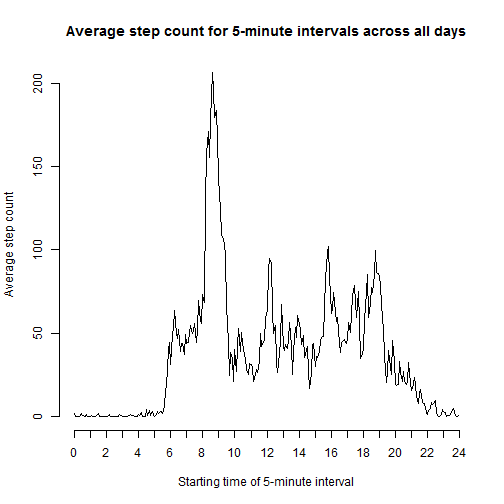
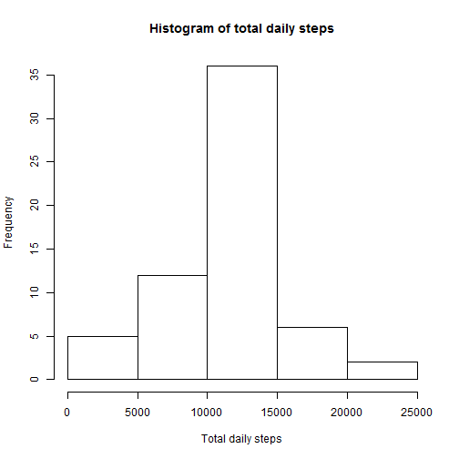
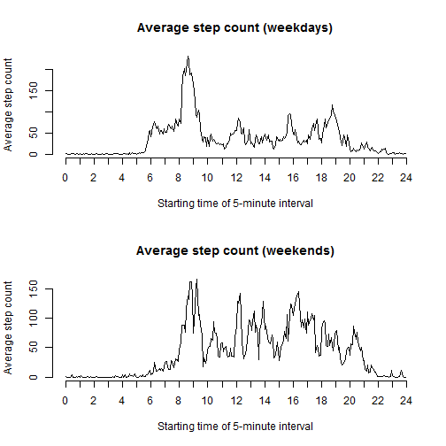

## Loading and preprocessing the data

```r
# Helper function to convert times into more readable time strings.
# E.g. 830 --> "08:30"
timestring <- function (num) {
    string <- sprintf("%04d", num)  # Pad with leadng zeros so it is 4 digits long
    string <- paste0(substr(string, 1, 2), ":", substr(string, 3, 4))  # insert colon
    return(string)
}

# Helper function to convert times into decimal numbers (hours).
# E.g. 830 --> 8.5
decimalhours <- function (num) {
    hours <- floor(num/100)
    minutes <- num - hours * 100
    return(hours + minutes/60)
}

# Unzip and read in data
unzip("activity.zip")
data <- read.csv("activity.csv", colClasses=c("integer", "Date", "integer"))

# Add time string and time as a decimal number to data frame
data$timestring <- timestring(data$interval)
data$decimalhours <- decimalhours(data$interval)
```


## What is mean total number of steps taken per day?

```r
# 1. Make a histogram of the total number of steps taken each day
totalSteps <- tapply(data$steps, data$date, sum)
hist(totalSteps, xlab="Total daily steps", main="Histogram of total daily steps")
```

 

```r
# 2. Calculate and report the mean and median total number of steps taken per day
mean <- mean(totalSteps, na.rm = TRUE)
median <- median(totalSteps, na.rm = TRUE)
cbind("mean" = mean, "median" = median)
```

```
##          mean median
## [1,] 10766.19  10765
```

## What is the average daily activity pattern?

```r
# 1. Make a time series plot of the 5-minute interval and the average number of steps
# taken averaged across all days.

# Average step counts for each 5-minute interval across all days
averageAcrossIntervals <- tapply(data$steps, data$timestring, mean, na.rm = TRUE)

# Store interval starting times as decimal number (hours) which can be used as
# the x-value in the plot. The first 288 values cover one whole day of 5-minute
# intervals (5 x 288 = 1440 minutes = 24 hours)
intervalsAsDecimalHours = data$decimalhours[1:288]

plot(intervalsAsDecimalHours, averageAcrossIntervals, type="l", axes=FALSE, 
     xlab="Starting time of 5-minute interval",
     ylab="Average step count",
     main="Average step count for 5-minute intervals across all days")
axis(1, at=seq(0, 24, 1))  # Force hourly tick marks on x-axis
axis(2)
```

 

```r
# 2. Which 5-minute interval averaged across all days contains the maximum number of steps?
maxTime <- names(which.max(averageAcrossIntervals))
maxValue <- max(averageAcrossIntervals)
rbind("Max steps (average) occur in interval starting at" = maxTime,
      "Max step count average" = maxValue)
```

```
##                                                   [,1]              
## Max steps (average) occur in interval starting at "08:35"           
## Max step count average                            "206.169811320755"
```

## Imputing missing values

```r
# 1. Calculate and report the total number of missing values in the dataset
isNa = is.na(data$steps)  # Find the NA values
sum(isNa)  # Count them (sum will regard TRUE as 1, FALSE as 0, giving number of NAs)
```

```
## [1] 2304
```

```r
# 2. Devise a strategy for filling in all of the missing values in the dataset.
#      i) Copy steps data to a new column (imputedSteps)
#     ii) Replace all missing values with the average step count for the corresponding
#         interval, taken across all days in the dataset.

# 3. Create imputedSteps column with mean steps for corresponding interval taken over all days
data$imputedSteps <- data$steps
data[isNa, "imputedSteps"] <- averageAcrossIntervals[data[isNa, "timestring"]]

# 4. Repeat histogram and mean & median calculation of daily stepcount after imputing missing values
totalSteps <- tapply(data$imputedSteps, data$date, sum)  # Calculate total steps for each date
hist(totalSteps, xlab="Total daily steps", main="Histogram of total daily steps")
```

 

```r
mean <- mean(totalSteps, na.rm = TRUE)  # Calculate mean of total steps across all days
median <- median(totalSteps, na.rm = TRUE)  # Calculate median of total steps across all days
cbind("mean" = mean, "median" = median)  # Show results
```

```
##          mean   median
## [1,] 10766.19 10766.19
```


## Are there differences in activity patterns between weekdays and weekends?

```r
# Helper function to classify days into weekend/weekday
classifyDay <- function(day) {
    return(ifelse(day %in% c("Saturday", "Sunday"), "weekend", "weekday"))
}

# 1. Classify days into weekdays/weekends
originalLocale <- Sys.getlocale("LC_TIME")  # swich locale to ensure predictable 
Sys.setlocale("LC_TIME", "English")         # output from weekdays()
```

```
## [1] "English_United States.1252"
```

```r
data$dayType <- factor(classifyDay(weekdays(data$date)))  # Classify days

Sys.setlocale("LC_TIME", originalLocale)    # swich locale back to original
```

```
## [1] "Finnish_Finland.1252"
```

```r
# 2. Make the required panel plot

# Calculate average steps across all intervals for weekday/weekend subsets of data
averageAcrossIntervalsWdays <- with(subset(data, dayType == "weekday"), 
                                    tapply(imputedSteps, timestring, mean))
averageAcrossIntervalsWends <- with(subset(data, dayType == "weekend"), 
                                    tapply(imputedSteps, timestring, mean))

# Draw panel plot showing averages that we just calculated
par(mfcol=c(2, 1))
plot(intervalsAsDecimalHours, averageAcrossIntervalsWdays, type="l", axes=FALSE, 
     xlab="Starting time of 5-minute interval", ylab="Average step count",
     main="Average step count (weekdays)")
axis(1, at=seq(0, 24, 1))  # Force hourly tick marks on x-axis
axis(2)
plot(intervalsAsDecimalHours, averageAcrossIntervalsWends, type="l", axes=FALSE, 
     xlab="Starting time of 5-minute interval", ylab="Average step count",
     main="Average step count (weekends)")
axis(1, at=seq(0, 24, 1))  # Force hourly tick marks on x-axis
axis(2)
```

 
